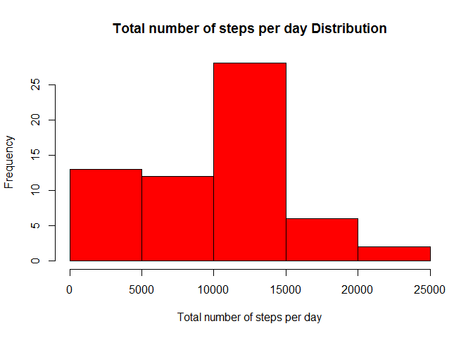

# Reproducible Research: Peer Assessment 1

```r
    library(dplyr)
```

```
## 
## Attaching package: 'dplyr'
## 
## The following objects are masked from 'package:stats':
## 
##     filter, lag
## 
## The following objects are masked from 'package:base':
## 
##     intersect, setdiff, setequal, union
```

```r
    library(ggplot2)
    library(knitr)
```

```
## Warning: package 'knitr' was built under R version 3.2.2
```

```r
## Loading and preprocessing the data
# Unzips the activity file into the current directory
    unzip("./activity.zip")
    activity_data <- read.csv("activity.csv")
```
## What is mean total number of steps taken per day?

```r
# Finds the total number of steps per day
    step_per_day_data <- group_by(activity_data, date) %>% summarize(summed_steps=sum(steps,na.rm=TRUE)) 

# Plots a histogram of total number of steps per day
    hist(step_per_day_data$summed_steps, col = "Red", xlab = "Total number of steps per day",ylab = "Frequency", main = "Total number of steps per day Distribution")
```

 

```r
# determines the mean and media number of steps per day.
    mean_steps <-mean(step_per_day_data$summed_steps)
    median_steps <- median(step_per_day_data$summed_steps)
# The mean number of steps is
    mean_steps
```

```
## [1] 9354.23
```

```r
# The median number of steps is
    median_steps
```

```
## [1] 10395
```
## What is the average daily activity pattern?

```r
# Find the average per interval
    average_per_interval <- group_by(activity_data, interval) %>% summarize(average_steps_int=mean(steps,na.rm=TRUE)) 

# Plots a time series plot of average number of steps per interval
    plot(average_per_interval$interval, average_per_interval$average_steps_int,type="l",col = "green", xlab="Interval", ylab = "Average number of steps",  main = "Average number of steps vs interval")
```

 

```r
# Determines the 5-minute interval where the average number of steps is a maximum
    max_interval <- average_per_interval[which.max(average_per_interval$average_steps_int),1]
    max_interval
```

```
## Source: local data frame [1 x 1]
## 
##   interval
## 1      835
```
## Imputing missing values

```r
# Counts the number of rows with missing values
    sum(is.na(activity_data$steps))
```

```
## [1] 2304
```

```r
# Replaces all the NA values in the steps column with their average number of steps for that interval arranged by date
    merged_with_average <- merge(activity_data,average_per_interval,by.x="interval")
    arrange_merged <-arrange(merged_with_average,date)
    rowcount <-nrow(arrange_merged)
    for(i in 1:rowcount) {
        if(is.na(arrange_merged[i,2])==TRUE){
	          arrange_merged[i,2] <- arrange_merged[i,4]
	      }
    }

# Finds the total number of steps per day with the new data set
    replaced_total_steps <- group_by(arrange_merged, date) %>% summarize(summed_steps=sum(steps))

# Plots a histogram of total number of steps vs day with NA values replaced with their average for that interval
    hist(replaced_total_steps$summed_steps, col = "Orange", xlab = "Total number of steps per day",ylab = "Frequency", main = "Total number of steps per day with missing values replaced")
```

 

## Are there differences in activity patterns between weekdays and weekends?


```r
# Determines which days are weekends and weekdays
    arrange_week <- mutate(arrange_merged,day_type = "day")

    for(i in 1:rowcount) {
        if(weekdays(as.Date(arrange_week[i,3])) == "Saturday"){
          arrange_week[i,5] <- "Weekend"
        }
        else if(weekdays(as.Date(arrange_week[i,3])) == "Sunday") {
          arrange_week[i,5] <- "Weekend"          
        }
        else {
          arrange_week[i,5] <- "Weekday"
        }
    }
    average_per_week  <- group_by(arrange_week, day_type, interval) %>% summarize(avg_steps=mean(steps))
    the_plot <- ggplot(average_per_week, aes(interval, avg_steps))+geom_line()+ facet_grid(day_type ~ .)
    the_plot <- the_plot + ggtitle("Average number of steps vs Interval")
  	the_plot <- the_plot + xlab("Interval") + ylab("Average number of steps")
  	print(the_plot)
```

 


